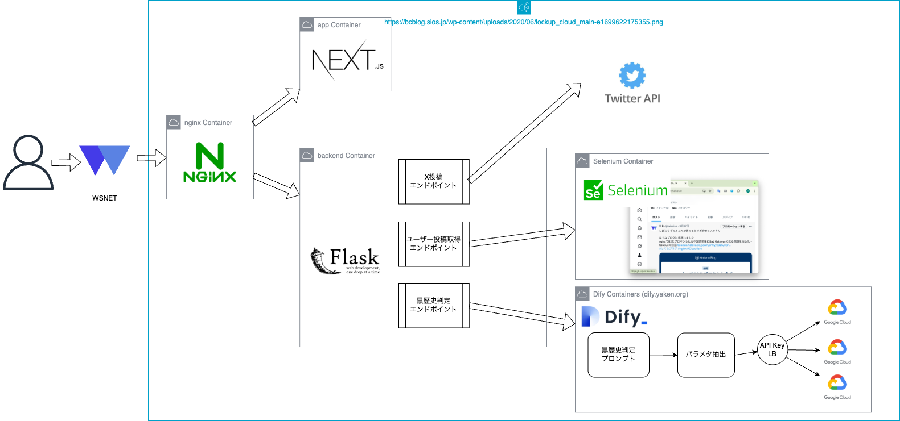

# sns-dark-history

<div align="center">
    
    <h3>SNS黒歴史探知機</h3>
    <p>Xのユーザーの、黒歴史ポストを洗いざらい検索します</p>
</div>

### What's this?
X(Twitter)のユーザーの黒歴史ポストを検索するソフトウェアです。
具体的な内容については、下記スライドもご覧ください。

https://www.canva.com/design/DAGiAUbpTOw/sfgl03MZ-S1wTUExJNqrZw/view?utm_content=DAGiAUbpTOw&utm_campaign=designshare&utm_medium=link2&utm_source=uniquelinks&utlId=hf09634099f

### Usage

#### セットアップ

はじめに、[.env.template](./x-posts-api/.env.template)を`./x-posts-api/.env`にコピーして、APIキーなどを書き込んでください。

次にXへのログインを行ないます。
下記コマンドでログインできます。

```sh
$ script/login
```

#### 起動

下記コマンドでローカル開発環境が立ちます。

```sh
$ script/localup
```

コマンドを実行したら、 http://localhost:8080/ を参照してください。

#### 起動(production環境)

production環境は下記コマンドで立ち上がります。

```sh
$ script/up
```

### Appendix
#### 構成図



### License

このソフトウェアは、[The MIT License](./LICENSE.txt)のもとで公開します。

Copyright (c) 2025 taiseiue, yamamoko1104, mai76  
Released under the [MIT license](./LICENSE.txt)